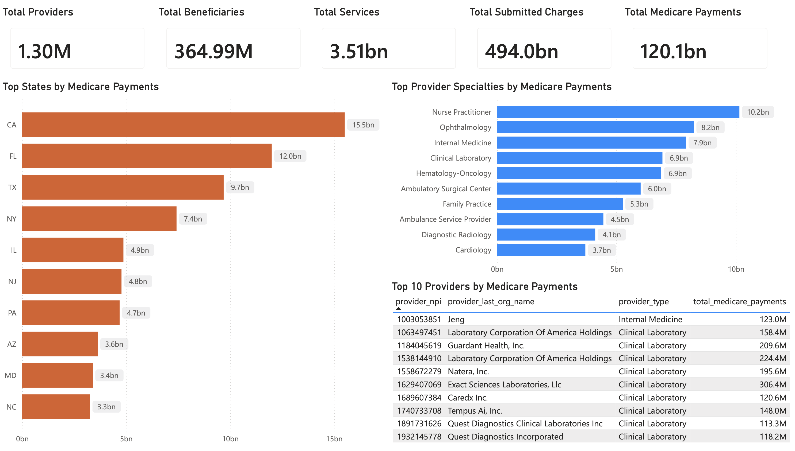
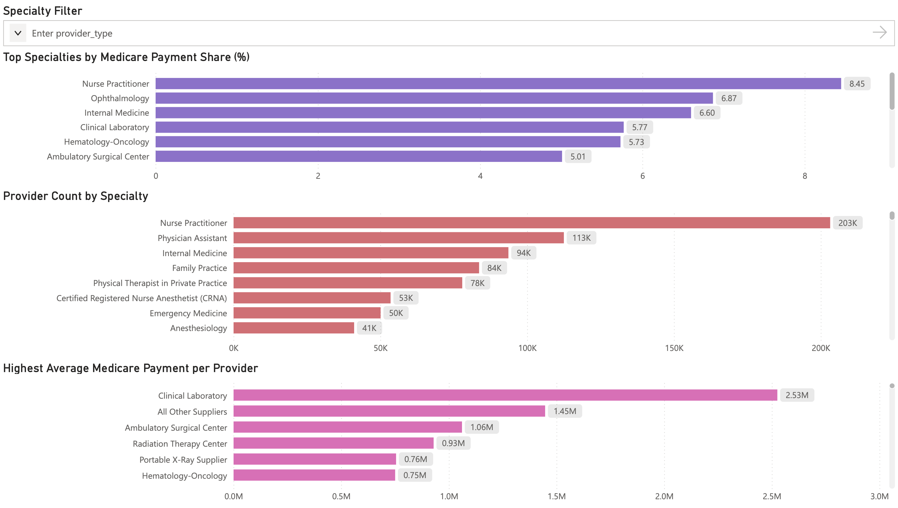

# Healthcare Analytics Data Warehouse

## Overview

This project demonstrates the design and implementation of a Healthcare Analytics Data Warehouse using Medicare Provider Utilization and Payment data.

The solution combines Python-based ETL development, PostgreSQL dimensional modeling, SQL analytics, and Power BI reporting to support healthcare reimbursement and provider performance analysis at scale.

The project transforms raw healthcare claims data into a star-schema warehouse and delivers executive-level reporting through interactive Power BI dashboards.

---

## Technology Stack

### Data Engineering

* Python
* Pandas
* PostgreSQL

### Analytics

* SQL
* Window Functions
* Common Table Expressions (CTEs)
* Analytical Views

### Business Intelligence

* Power BI

### Development Tools

* Jupyter Notebook
* VS Code
* Git
* GitHub

---

## Data Warehouse Architecture

### Star Schema

```text
                 dim_provider
                        |
                        |
                        |
dim_location ---- fact_provider_utilization ---- dim_date
```

### Fact Table

#### fact_provider_utilization

Contains provider-level healthcare utilization and reimbursement metrics including:

* Medicare payments
* Submitted charges
* Beneficiary counts
* Service counts
* Drug utilization metrics
* Medical utilization metrics
* Beneficiary demographic metrics
* Risk indicators

---

### Dimension Tables

#### dim_provider

Provider attributes:

* NPI
* Provider Name
* Provider Type
* Credentials
* Medicare Participation Status

#### dim_location

Location attributes:

* City
* State
* ZIP Code
* RUCA Classification

#### dim_date

Reporting period attributes:

* Reporting Year
* Quarter
* Month

---

## ETL Pipeline

### Extraction

Loaded Medicare Provider Utilization data from source CSV files.

### Transformation

Created:

* Provider Dimension
* Location Dimension
* Date Dimension
* Provider Utilization Fact Table

### Loading

Loaded warehouse tables into PostgreSQL.

### Validation

Performed:

* Row count validation
* Data integrity checks
* Foreign key validation
* Reimbursement consistency checks

---

## Analytical Views

The warehouse includes reusable analytical views for reporting.

### vw_executive_kpis

Provides:

* Total Providers
* Total Beneficiaries
* Total Services
* Total Submitted Charges
* Total Medicare Payments

### vw_state_medicare_payments

Provides:

* State-level Medicare spending
* Beneficiary analysis
* Service utilization analysis

### vw_specialty_performance

Provides:

* Provider counts
* Total payments
* Average payments
* Medicare payment share

### vw_top_provider_payments

Provides:

* Highest reimbursed providers
* Provider specialty analysis
* Medicare payment rankings

---

## Key Business Metrics

| Metric                  |   Value |
| ----------------------- | ------: |
| Total Providers         |   1.30M |
| Total Beneficiaries     | 364.99M |
| Total Services          |   3.51B |
| Total Submitted Charges | $494.0B |
| Total Medicare Payments | $120.1B |

---

## Business Insights

### Top States by Medicare Payments

* California
* Florida
* Texas
* New York
* Illinois

### Top Specialties by Medicare Payments

* Nurse Practitioner
* Ophthalmology
* Internal Medicine
* Clinical Laboratory
* Hematology-Oncology

### Highest Average Medicare Payment per Provider

* Clinical Laboratory
* Ambulatory Surgical Center
* Radiation Therapy Center
* Medical Oncology
* Rheumatology

---

## Power BI Dashboard

### Executive Overview

Provides:

* Enterprise KPIs
* State-level Medicare payment analysis
* Specialty payment analysis
* Top provider rankings

### Provider Performance Analysis

Provides:

* Medicare payment share by specialty
* Provider counts by specialty
* Average payment per provider
* Interactive specialty filtering

---

## Dashboard Screenshots

### Executive Overview



### Provider Performance Analysis



---

## Repository Structure

```text
healthcare-analytics-data-warehouse/

├── dashboard/
│   ├── healthcare-analytics-data-warehouse.pbix
│   └── healthcare-analytics-data-warehouse.pdf
│
├── data/
│   ├── raw/
│   └── sample/
│       └── claims_sample.csv
│
├── docs/
│   └── provider_data_dictionary.pdf
│
├── etl/
│   ├── create_sample_data.py
│   ├── export_warehouse.py
│   ├── generate_postgres_schema.py
│   └── load_warehouse_tables.py
│
├── notebooks/
│   └── Healthcare_Analytics_ETL.ipynb
│
├── reporting_exports/
│   ├── executive_kpis.csv
│   ├── specialty_performance.csv
│   ├── state_medicare_payments.csv
│   └── top_provider_payments_top1000.csv
│
├── reports/
│   ├── executive_overview.png
│   └── provider_performance_analysis.png
│
├── sql/
│   ├── 01_create_schema.sql
│   ├── 02_load_dimensions.sql
│   ├── 03_load_fact.sql
│   ├── 04_validation_queries.sql
│   ├── 05_analytical_views.sql
│   └── 06_business_analysis.sql
│
├── warehouse/
│
├── README.md
├── requirements.txt
└── .gitignore
```

---

## Dataset

This project uses Medicare Provider Utilization and Payment data.

The complete raw dataset is intentionally excluded from version control because of file size constraints.

A sample dataset is included for demonstration purposes:

```text
data/sample/claims_sample.csv
```

Users can reproduce the warehouse by supplying the original source data and executing the ETL pipeline.

---

## Skills Demonstrated

* Data Warehouse Design
* Dimensional Modeling
* Star Schema Architecture
* ETL Development
* PostgreSQL
* SQL Analytics
* Healthcare Analytics
* Power BI Dashboard Development
* Business Intelligence Reporting
* Data Engineering

---

## Author

**Aadityaa Dava**

Data Analytics | Business Intelligence | Data Engineering
